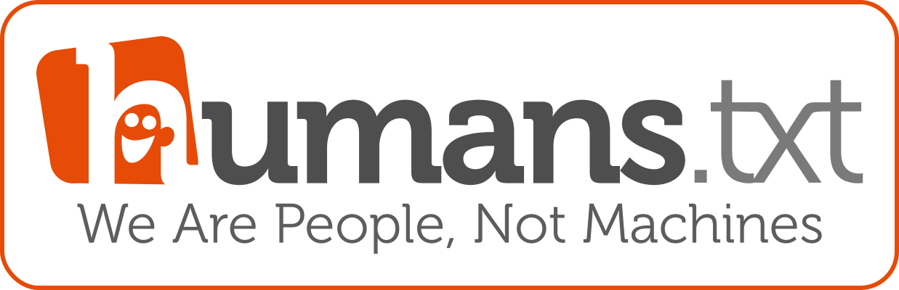
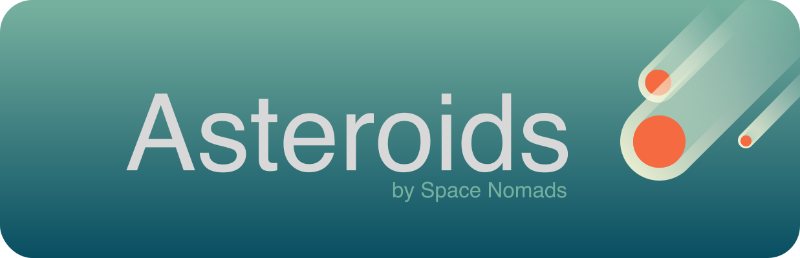

# Hi, I'm Chuck! 👋

<small>@October 15, 2022</small>  

I'm a graphic designer who learned to love HTML/CSS and sometimes JS. 24 years later I'm a **front-end developer** focused on **semantics**, **accessibility**. 

I also have a livestreamed show on Sundays called "**Maquetando con Chuck**" where I share what I know about coding HTML and CSS.

## Projects that I'm proud of

### Reach me on...

<!--
**oneeyedman/oneeyedman** is a ✨ _special_ ✨ repository because its `README.md` (this file) appears on your GitHub profile.

Here are some ideas to get you started:

- 🔭 I’m currently working on ...
- 🌱 I’m currently learning ...
- 👯 I’m looking to collaborate on ...
- 🤔 I’m looking for help with ...
- 💬 Ask me about ...
- 📫 How to reach me: ...
- 😄 Pronouns: ...
- ⚡ Fun fact: ...
-->
